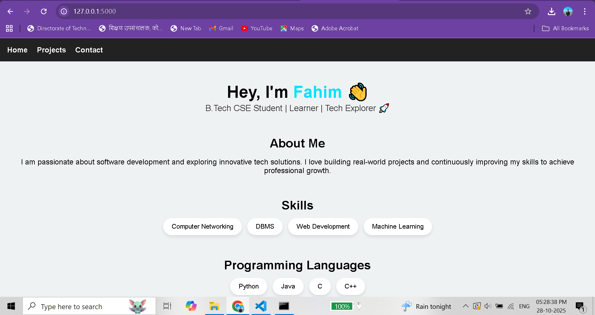
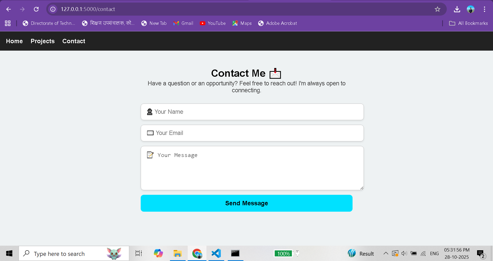
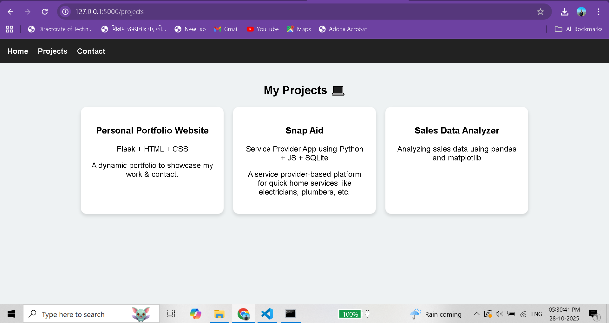

# 🌐 Personal Portfolio Website

A clean and modern **Portfolio Website** built using **Flask (Python)** with a working Contact Form.  
Showcase your skills, projects, and let others connect with you easily!

## 🚀 Features
- ✅ Home & About sections
- ✅ Skills & Projects showcase
- ✅ Contact Form with Flask backend
- ✅ Flash message after successful submission
- ✅ Fully customizable UI

## 🛠️ Tech Stack Used
| Technology | Purpose |
|-----------|---------|
| Python + Flask | Backend Web Framework |
| HTML + CSS | Structuring & Styling |
| Jinja2 | Templating System |
| VS Code | Recommended Editor |

## 💡 Skills
- Python, Java, C, C++
- HTML, CSS (Web Development Basics)
- Database Management (SQLite / MySQL basics)
- Computer Networking Fundamentals
- Basic Machine Learning knowledge

## 🧩 Projects
| Project Name | Tech Used | Description |
|------------|-----------|-------------|
| Personal Portfolio Website | Flask + HTML + CSS | A dynamic portfolio to showcase my work & contact. |
| Snap Aid | Python + JS + SQLite | A service provider-based platform for quick home services like electricians, plumbers, etc. |
| Sales Data Analyzer | Pandas + Matplotlib | Performed data analysis on CSV files with visual charts. |

## 📸 Screenshots

  

---

## ⚙️ How to Run :

1️⃣ Check if Python is installed  
    python --version
2️⃣ Install Flask
    pip install flask
3️⃣ Go to project folder
    cd path/to/your/project
4️⃣ Run Flask app
    python app.py
5️⃣ Open browser
    http://127.0.0.1:5000/

## 📂 Project Structure

📁 Portfolio-Website
 ├─ app.py
 ├─ 📁 templates
 │   ├─ base.html
 │   ├─ index.html
 │   ├─ contact.html
 ├─ 📁 static
 │   ├─ style.css
 │   ├─ home.png
 │   ├─ contact.png
 │   ├─ projects.png

## 👨‍💻 Author
Fahim Shaikh
SY BTECH in Computer Science & Engineering
🚀 Passionate Python & Web Dev Learner

